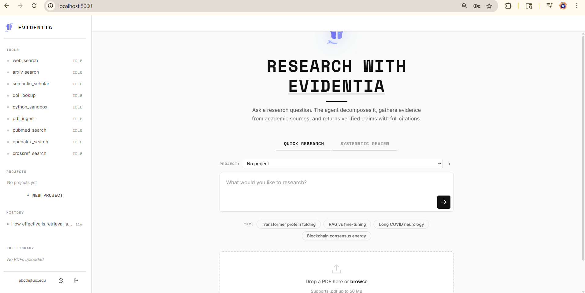
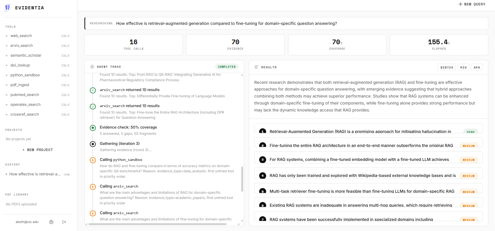
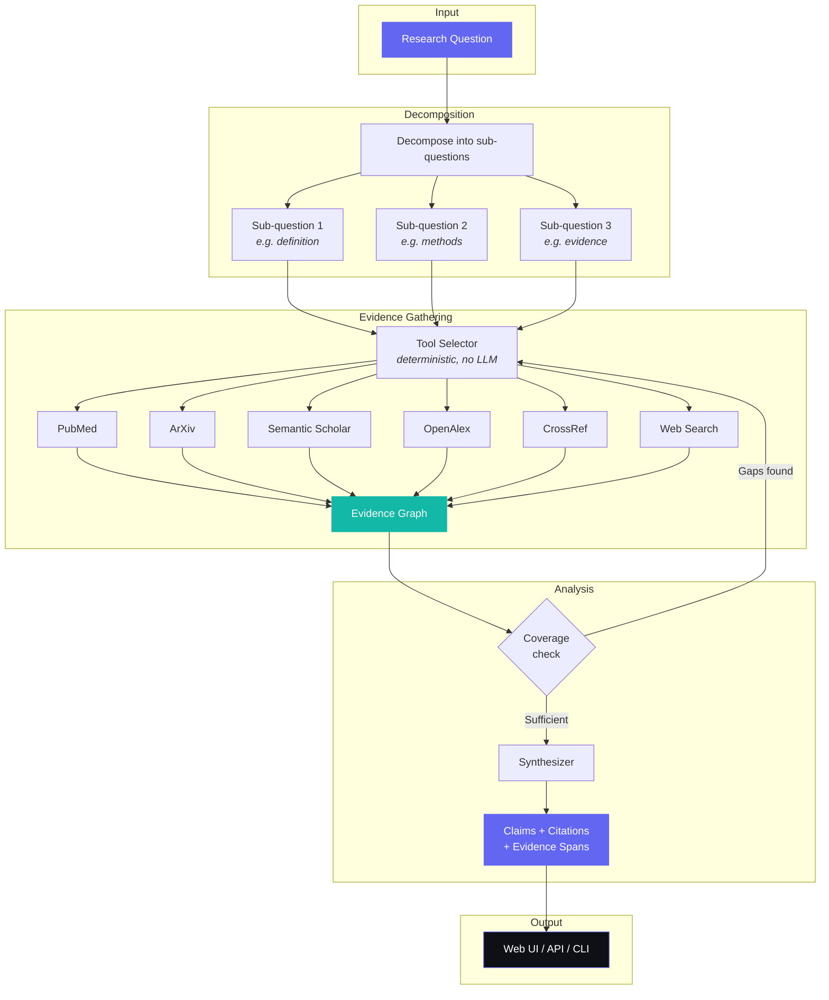
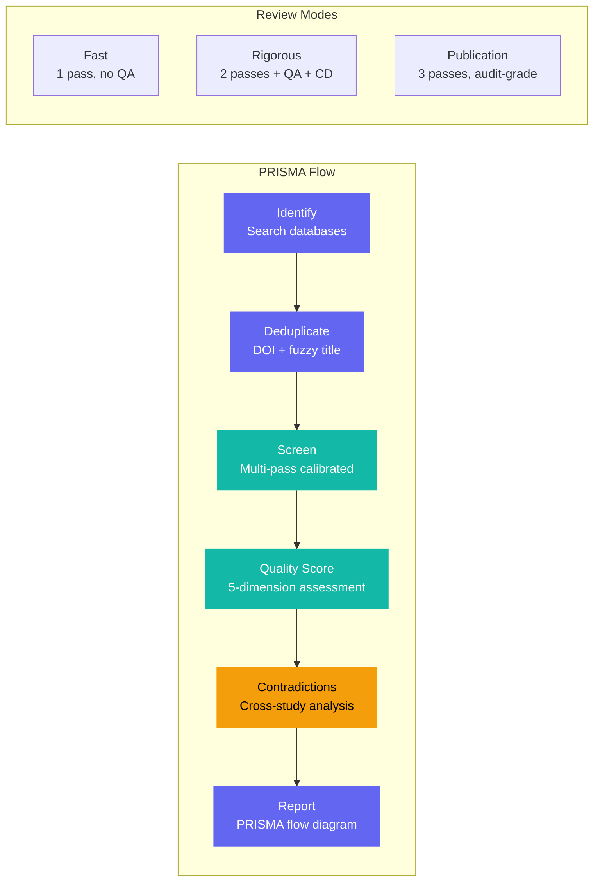

<p align="center">
  
  
  
  
</p>

# Evidentia

**A research agent that actually cites its sources.**

Evidentia is an AI-powered research tool that answers academic questions by searching real databases (PubMed, ArXiv, Semantic Scholar, OpenAlex, CrossRef), gathering evidence, and constructing verified claims with full citations. It also runs complete systematic literature reviews following the PRISMA methodology.

Unlike chatbots that hallucinate references, Evidentia retrieves real papers, links every claim to its source, and tells you when the evidence is conflicting or insufficient.

<p align="center">
  
  <br>
  <em>Ask any research question — Evidentia searches real academic databases and builds verified claims.</em>
</p>

<p align="center">
  
  <br>
  <em>Every claim is graded by confidence, backed by real citations, and fully traceable.</em>
</p>

---

## What it does

**Ask a research question:**
> "What are the latest advances in transformer architectures for protein folding prediction?"

**Get back:**
- Verified claims, each graded by confidence (high / medium / low / conflicting)
- Real citations with links to the actual papers
- Evidence spans showing exactly which part of each paper supports each claim
- A full trace of every database searched and every tool called

**Or run a systematic review:**
> "Effectiveness of CBT for treatment-resistant depression"

**Get back:**
- PRISMA-compliant pipeline: Identification, Deduplication, Screening, Inclusion
- Multi-pass calibrated screening with per-criterion explainability
- Evidence quality scoring (methodology, sample size, bias risk, reproducibility)
- Cross-study contradiction detection with taxonomy (empirical, methodological, interpretive, population)
- Export to CSV, BibTeX, or RIS

---

## How it works



### Systematic Review Pipeline



---

## Quick Start

### Prerequisites

- Python 3.11+
- An LLM API key (Anthropic or OpenAI)

PostgreSQL and Redis are optional — the app falls back to in-memory storage automatically.

### Install

```bash
git clone https://github.com/yourusername/evidentia.git
cd evidentia
pip install -e ".[dev]"
```

### Configure

```bash
cp .env.example .env
# Edit .env and add your LLM API key:
#   ANTHROPIC_API_KEY=sk-ant-...
#   or OPENAI_API_KEY=sk-...
```

### Run

```bash
python -m uvicorn evidentia.api.server:app --host 0.0.0.0 --port 8000
```

Open [http://localhost:8000](http://localhost:8000) in your browser.

---

## Features

### Research Agent
- **Multi-database search** — PubMed, ArXiv, Semantic Scholar, OpenAlex, CrossRef, web search
- **Query decomposition** — breaks complex questions into targeted sub-queries
- **Evidence graph** — tracks what's been found, what's missing, and what conflicts
- **Multi-iteration gathering** — re-searches when coverage gaps are detected
- **Claim synthesis** — structured claims with confidence scores and evidence spans
- **Citation export** — BibTeX, RIS, APA formats
- **PDF ingestion** — upload and search your own papers

### Systematic Reviews
- **PRISMA-compliant pipeline** — Identification, Deduplication, Screening, Inclusion
- **Three review modes** — Fast (1-pass), Rigorous (2-pass calibrated), Publication (3-pass audit-grade)
- **Per-decision explainability** — maps each screening decision to specific inclusion/exclusion criteria
- **Evidence quality scoring** — 5-dimensional assessment (methodology, sample, bias, reproducibility, statistics)
- **Contradiction detection** — taxonomy of empirical, methodological, interpretive, and population conflicts
- **Reproducibility hash** — SHA-256 of run inputs for audit trails
- **Manual override** — review uncertain papers and override decisions

### Platform
- **Real-time streaming** — watch the agent work via WebSocket
- **Persistent sessions** — 30-day login, per-user history
- **API key management** — generate keys for programmatic access
- **Project organization** — group research runs into projects
- **Dark theme UI** — clean, monospace-inspired design

---

## Project Structure

```
evidentia/
├── api/            # FastAPI server, routes, auth, middleware
├── core/           # Config, models, logging, exceptions
├── db/             # SQLAlchemy ORM, repositories
├── tools/          # Database search tools (ArXiv, PubMed, etc.)
├── schemas/        # Pydantic request/response contracts
├── validator/      # Citation & schema validation
├── export/         # BibTeX, RIS, CSV formatters
├── cache.py        # Redis caching layer
├── web/static/     # Frontend (HTML + JS + CSS)
└── cli/            # Command-line interface
tests/              # 419 tests
```

---

## API

### REST Endpoints

| Method | Endpoint | Description |
|--------|----------|-------------|
| `POST` | `/api/v1/auth/register` | Create account |
| `POST` | `/api/v1/auth/login` | Sign in |
| `GET` | `/api/v1/tools` | List available tools |
| `POST` | `/api/v1/reviews` | Start systematic review |
| `GET` | `/api/v1/reviews/{id}/papers` | Get review papers |
| `POST` | `/api/v1/reviews/{id}/export` | Export results |
| `POST` | `/api/v1/upload/pdf` | Upload a PDF |

### WebSocket

| Endpoint | Description |
|----------|-------------|
| `/ws/query?token=...` | Stream research agent results |
| `/ws/review?token=...` | Stream systematic review progress |

---

## Development

```bash
# Run tests
python -m pytest tests/ -v

# Type check
mypy evidentia/

# Format
ruff format .

# Lint
ruff check .
```

---

## Tech Stack

| Layer | Technology |
|-------|-----------|
| Backend | Python, FastAPI, SQLAlchemy, Pydantic |
| LLM | Anthropic Claude / OpenAI (configurable) |
| Search | PubMed, ArXiv, Semantic Scholar, OpenAlex, CrossRef |
| Database | PostgreSQL + pgvector (optional) |
| Cache | Redis (optional) |
| Auth | JWT + bcrypt |
| Frontend | Vanilla HTML/CSS/JS (no framework) |

---

## License

Apache 2.0 — see [LICENSE](LICENSE) for details.
